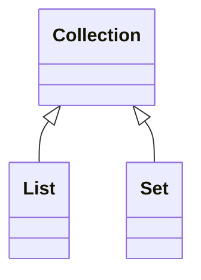

---
{"dg-publish":true,"permalink":"/books/2024/java-in-a-nutshell/chapter-8-working-with-java-collections-1/","title":"Chapter 8 - Working with Java Collections","tags":["book","java"]}
---

## Java Collections
A set of generic interfaces that describe the most common forms of data structure.

### Collection

```
> `Set` is  a type of `Collection` with **no duplicate**
> `List` is a type of `Collection` in which elements are **ordered** (but may contain duplicates)
### Map

### Iterator / Iterable
Allows to loop through the objects in a collection

`Collection<E>` is a parameterized interface that represents a generalized grouping of objects of type `E`. We can create a collection of any kind of **reference** type
> [!info] Implement Methods
> 
To work properly with the expectations of collections, we must take care when defining `hashCode()` and `equals()` methods on the classes.

> [!info] Cloneable/Serializable
> 
Collection, Map, and their subinterfaces do not extend the interfaces Cloneable or
Serializable. All of the collection and map implementation classes provided in the
Java Collections Framework, however, do implement these interfaces.

### List
A `List` is an ordered collection of objects. The `List` interface defines methods to query or set the element a a particular position, or **index**

The `List` defines a single `sublist()` method that returns a `List` object that represents the range of the original list.
> The sublist is **backed** by the parent list. Any changes made to the sublist a immediately visible in the parent list

#### Foreach loops and iteration
```java
List<String> c = new ArrayList<>()

for(String word : c) { // foreach loop
	System.out.println(word);
}
```

- The **expression** must be either an array or an object that implements `java.lang.Iterable` interface
- The type of the array or `Iterable` elements must be assignment-compatible with the type of the variable declared in the **declaration**
- The loop variable of the foreach loop must be declared as part of the loop

### Map
A `map` is a set of **key** objects and a mapping from each member of that set to a **value** object.
- A `map` is NOT a `Collection`
- The keys of `map` can be viewed as a `Set`
- The values can be viewed as `Collection`
- The mappings can be viewed as a `Set` of `Map.Entry` objects

> `Map.Entry`: a single key/value pair

### Queue
A `queue` is an ordered collection of elements with methods for extracting elements, in **order**, from the **head** of the queue in a commonly FIFO fashion.

- A `priority queue` orders its elements according to an external `Comparator` object or according to the natural ordering of `Comparable` elments.
- Unlike `Set`, `Queue` implements typically allow **duplicate** elements.
- Unlike `List`, `Queue` interface does not define methods for manipulating queue elements at arbitrary positions
- It is common for `Queue` implementations to have a **fixed capacity**. The `peek(), poll()` methods return `null` to indicate that the queue is empty.
- `Queue` implementations do NOT allow `null` elements.
- A `blocking queue` is a type of queue that defines **blocking** `put()` and `take()` methods. `BlockingQueue` is an important part of many multithreaded algorithms, defined in `java.util.concurrent` package

## Utility Methods
The `java.util.Collections` class is home to quite a few static utility methods designed for use with collections.

### Threadsafe wrappers
```java
List<String> list = Collections.synchronizedList(new ArrayList<>());
Set<String> set = Collections.synchronizedList(new HashSet<>());
Map<String, Integer> map = Collections.synchronizedList(new HashMap<>());
```

### Read-only wrappers
```java
List<Integer> primes = new ArrayList<>();
List<Integer> readonly = Collections.unmodifiableList(primes);

primes.addAll(Arrays.asList(2, 3, 5, 7)); // modify through the parent List is fine
readonly.add(23); // Throw UnsupportedOperationException
```

### Operational methods
```java
Collections.sort(list);
int pos = Collections.binarySearch(list, "key"); // The list must be sorted first

Collections.copy(list1, list2); // Copy list2 into list1, overwriting list1

Collections.fill(list, o); // Fill list with Object o

Collections.max(c); // Find the largest element in Collection c

Collections.min(c); // Find the smallest element in Collection c

Collections.reverse(list); // Reverse list

Collections.shuffle(list); // Mix up list
```

### Special-case wrappers
```java
// Empty, immutable collections
Set<Integer> set = Set.of(); 
List<String> list = List.of();
Map<String, Integer> map = Map.of();l

// returns an immutable List contains a specified number of copies of a single specified object
List<Integer>tenzeros = Collections.nCopies(10, 0); 
```

### Arrays and Helper methods
```java

// Convert an array to a List collection - Arrays.asList()
String[] a = { "this", "is", "a", "test" };
List<String> l = Arrays.asList(a);
List<string> m = new ArrayList<>(l);

// Convert a collection to an array - <collection>.toArray();
Object[] members = set.toArray();
Object[] items = list.toArray();
Object[] keys = map.Keyset().toArray();
Object[] values = map.values().toArray();

// Specify array type to be converted to
String[] c = l.toArray(new Stirng[0]);
```

## Java Streams and Lambda Expressions
The introduction of the **functional collections** - which are called **Java Streams** to make clear their divergence from the older collections approach - is an important step forward. A stream can be created from a collection simply by calling the `stream()` method on an existing collection.

> package: `java.util.function`
### Filter
The filter idiom applies a piece of code returning either `true` or `false` (known as **predicate**) to each element of a collection. A new collection is built consisting of the elements that "*passed the test*".

```java
List<String> cats = List.of("tiger", "cat", "TIGER", "leopard");
String search = "tiger";
String tigers = cats.stream()
					.filter(s -> s.equalsIgnoreCase(search))
					.collect(Collectors.join(", "));
System.out.println(tigers);
```

The `filter()` method takes in an instance of the `Predicate` interface, from the package `java.util.function`. This is a functional interface, with only a single nondefault method, and so is a perfect fit for a *lambda expression*

### Map
The map idiom makes use of the interface `Function<T, R>` in the package `java.util.function`. Like `Predicate<T>`, this is a functional interface so only has one nondefault method, `apply()`. The map idiom is about transforming one stream into a new stream, where the new stream potentially has different types and values than the original.

```java
List<Integer> namesLength = cats.stream()
								.map(String::length)
								.toList();
System.out.println(namesLength);
```

### forEach
```java
List<String> pets = List.of("cat", "dog", "fish");
pets.stream().forEach(System.out::println);
```

### Reduce
This implements the reduce idiom, which is really a family of similar and related operations, some referred to as **fold**, or **aggregation** operations.
```java
T reduce(T identity, BinaryOpoerator<T> aggregator);
```

The easy way to think about the second argument to `reduce()` is that it creates a "*running total*" as it runs over the stream.
Imagine the implementation of `reduce()` works a bit like the following:
```java
public T reduce(T identity, BinaryOperator<T> aggregator) {
	T runningTotal = identity;
	for(T element : myStream) {
		runningTotal = aggregator.apply(runningTotal, element);
	}

	return runningTotal;
}
```

Example:
```java
double sumPrimes = List.of(2, 43, 5, 7, 11, 13, 17, 19, 23)
					   .stream()
					   .reduce(0, (x, y) -> x + y);
System.out.println("Sum of some primes: " + sumPrimes);					   
```

## The Streams API
