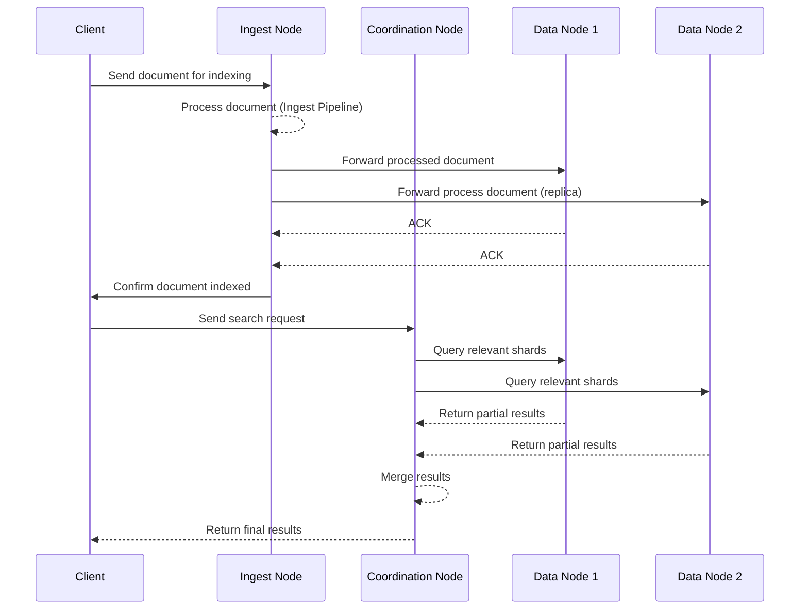

---
{"dg-publish":true,"permalink":"/Notes/2024/Elasticsearch/","title":"Elasticsearch","tags":["quick_note","Data"]}
---

> )

## Terms
- Index
  > An index contains multiple documents. Conceptually, it can be thought of as "**Table**" in RDBMS world.
  
- Document
  > A document is a JSON blob. It may contain multiple fields in various types. Conceptually, it can be thought of as "**row**"/"**record**" in RDMS world.
  
- Mapping
  > A mapping is like a schema. It allows to specify data types to fields for the search. By default, Elasticsearch will guess mappings for every field based on its content.
  
- Shard
  > An **index** can be broke down to multiple **shards** in ES. A sharding strategy is needed to fine-tune the ES to have a best performance. One big shard theoretically will give a better performance than multiple small shards. There is no hard limitation on a shard size. It's based on the infrastructure, resources and applications. However, the rule of thumb is that a shard size should be between **10 - 50 GB** and a shard should contain no more than **200 mil documents**.
   
- Lucene Index
  > A Lucene Index is 1-to-1 mapping to a shard. A Lucene Index contains multiple **Segments**.
    
- Segment
  > A segment is a immutable section of an **Index**. Internally, **Indexes** evolve by:
  >    1. Creating new **segments** for newly added **documents**. 
  >    2. Merging existing **segments**
  >       
  
- Replica
  > Each shard can be replicated into multiple ES nodes for the fault tolerance and search performance purposes.

## System
- Inverted Index
  An **inverted index** is a hashmap-like data structure that stores a mapping from content to document(s) that contain it. By using distributed inverted indices, Elasticsearch quickly finds the best matches for full-text searches.
  
  
  
- Nodes
  Elasticsearch is a distributed system that is composed of different type of nodes. A node can be a physical machine or a VM. A physical machine or a VM can contain have a setup with more than one node.
  
  - Master Node
    There can be multiple **eligible** master nodes, but only ONE **master node** is running at a given of time in an ES system; is responsible for all cluster-wide operations like creating/deleting an index and adding/removing other nodes
    
  - Coordination Node / Client Node
    A client node is like an API layer to an ES system. It in charge of routing cluster requests to **Master Node** and query requests to **Data Node**. It can provide optimal query plans for a search.
    
  - Data Node
    The responsibility of a data node is to execute data-related operations. Ex. search and aggregation
    
  - Ingest Node
    The Ingest Node takes care of the data ingestion (pipeline) that can perform common data transformation and enrichment.
    
  - Machine Learning Node


    
- Lucene Index
  
  
  Lucene uses "columnar store" (**doc values**) to filter field values across all the documents very quickly. 
## Operation
- Create Index
```json
// PUT /books
{
  "settings": {
	  "number_of_shards": 1,
	  "number_of_replicas": 1
  }
}
```

- Create mapping
```json
// PUT /books/_mapping
{
	"properties": {
		"title": { "type": "text" },
		"author": { "type": "text" },
		"price": { "type": "float" },
		"reviews": {
			"type": "nested",
			"properties": {
				"user": { "type": "keyword" },
				"rating": { "type": "integer" }
			}
		}
	}
}
```

- Create document
```json
// POST /books/_doc
{
	"title": "ABC",
	"author": "unknown",
	"price": 9.99,
	"reviews": [
		{
			"user": "reader1",
			"rating": 0
		},
		{
			"user": "reader2",
			"rating": 4
		}
	]
}
// Result
{
	"_index": "books",
	"_id": "Kqawoeiru234asdkj",
	"_version": 1,
	"result": "created",
	"_shards": {
		"total": 2,
		"successful": 1,
		"failed": 0
	},
	"_seq_no": 0,
	"_primary_term": 1
}
```

- Update document (provide version to avoid collision; race condition)
```json
// PUT /books/_doc/Kqawoeiru234asdkj?version=1
{
	"title": "ABC",
	"author": "unknown",
	"price": 13.99,
	"reviews": [
		{
			"user": "reader1",
			"rating": 0
		},
		{
			"user": "reader2",
			"rating": 4
		}
	]
} 
// POST /books/_update/Kqawoeiru234asdkj
{
	"doc": {
		"price": 14.99
	}
}
```

- Search
```json
// GET /books/_search
{
	"query": {
		"match": {
			"title": "ABC"
		}
	}
}

// GET /books/_search
{
	"query": {
		"bool": {
			"must": [
				{ "match": { "title": "ABC" } },
				{ "match": { "price": { "lte": 15 } } }
			]
		}
	}
}

// Result
{
	"took": 7,
	"timed_out": false,
	"_shards": {
		"total": 5,
		"successful": 5,
		"skipped": 0,
		"failed": 0
	},
	"hits": {
		"total": {
			"value": 2,
			"relation": "eq"
		},
		"max_score": 2.18023,
		"hits": [
			{
				"_index": "books",
				"_type": "_doc",
				"_id": 1,
				"_score": 2.18023,
				"_source": {
					"title": "ABC",
					"author": "unknown",
					"price": 12.99
				}
			}
		]
	},
	
	
}
```
- Sort
```json
// GET /books/_search
{
	"sort": [
		{ "price": "asc" },
		{ "publish_date": "desc" }
	],
	"query"": ...
}

// GET /books/_search
{
	"sort": [
		{
			"_script": {
				"type": "number",
				"script": {
					"source": "doc['price'].value = 0.9"
				},
				"order": "asc"
			}
		}
	],
	...
}

// GET /books/_search
{
	"sort": [
		{
			"reviews.rating": {
				"order": "desc",
				"mode": "max",
				"nested": {
					"path": "reviews"
				}
			}
		}
	],
	...
}
 ```
## Scoring
TF-IDF - Term Frequency and Inverse Document frequency
- TF - a keyword has a high freq. appearance (high density) in a document but not so high in other documents
- IDF - a keyword is not informative when it commonly appear in most of the documents

## Pagination
- Stateful
```json
// GET /books/_search
{
	"from": 0,
	"size": 10,
	"query": ...
}

// GET /books/_search
{
	"size": 10,
	"query": ...,
	"sort": [
		{ "date": "desc" },
		{ "_id": "desc" }
	],
	"search_after": [1463538857, "654323"]
}
```
 
- Stateless (**PIT**: point-in-time)
```json
// POST /books/_pit?keep_alive=1m
// return an id: "46To..."

// GET /_search
{
	"size": 10,
	"query": {
		"match": {
			"title": "ABC"
		}
	},
	"pit": {
		"id": "46To...",
		"keep_alive": "1m"
	},
	"sort": [
		{"_score": "desc"},
		{"_id": "asc"}
	]
}

// DELETE /_pit
// remember to delete the point-in-time snapshot to avoid excessive memory allocation
{
	"id": "46To..."
}
```
## Considerations
- Elasticsearch should not be the primary database
  Durability and Availability is not very well-played for ES. Use "Change Data Capture" (CDC) to update ES from a primary database.
  
- It's best for read-heavy workloads
  Even though write counts can be limited by doing batches or other type of optimization, consider using ES only when high-performance searching is the primary use case
  
- Must tolerate eventual consistency
  Delay versions of the data. (double-booking issue)
  
- Denormalization is the key
  Should not need joins
  
- Do you even need it?
  High maintenance and operation costs should be considered before betting on ES
## Issues
- Race condition
	Documents can be added, updated and deleted at any given of time. An example of race condition can happen when there are two clients trying to update a same document. 